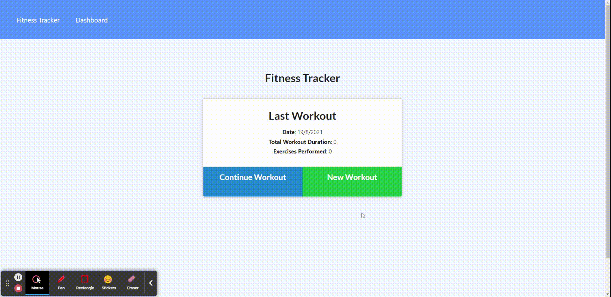
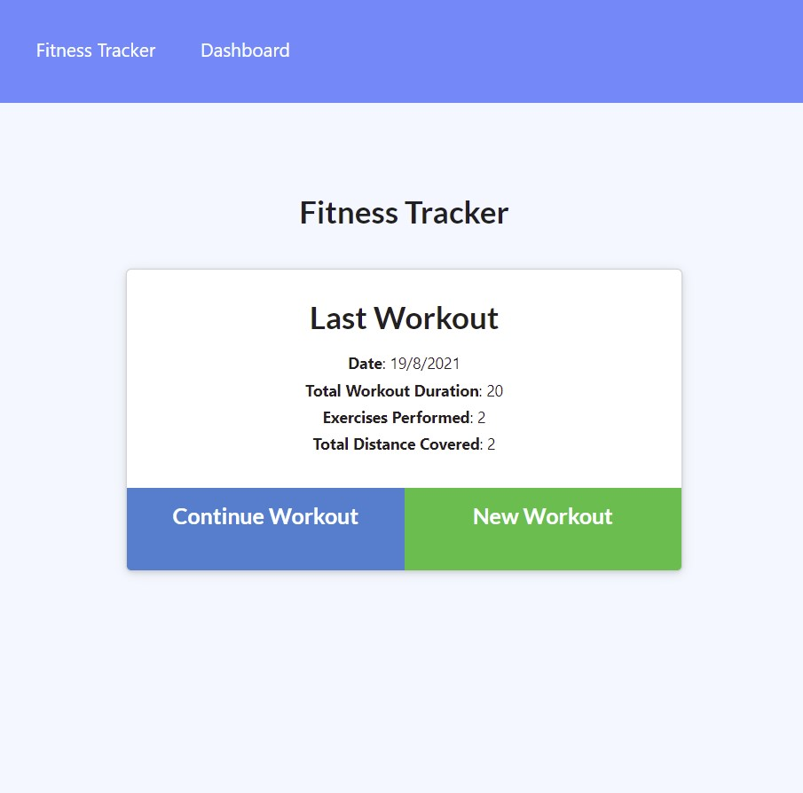
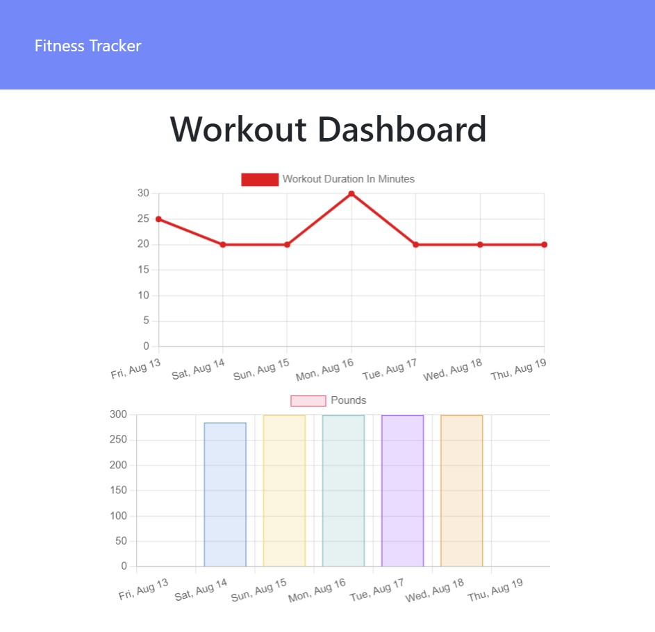

# Workout-Tracker

## Description
This application is a Workout Tracker, which records distance, duration, repetitions of different excercises, and displays them in a dashboard. This app uses express, MongoDB and Mongoose.

### Links
* Github Repository: https://github.com/ejpascualj/Workout-Tracker
* Deployed Application: https://workout-ejpascualj.herokuapp.com/

## Walkthrough and Screenshots
### Walkthrough Demo

### Homepage

### Dashboard

## Installation and Deployment

To install the necessary packages, open the terminal and run `npm install`. To deploy application locally, run `npm start` on the terminal.

## Development & Features

The technologies used for this development include: 
* NodeJs
* Express.js
* MongoDb 
* Mongoose

## License

This project is licensed under MIT license.